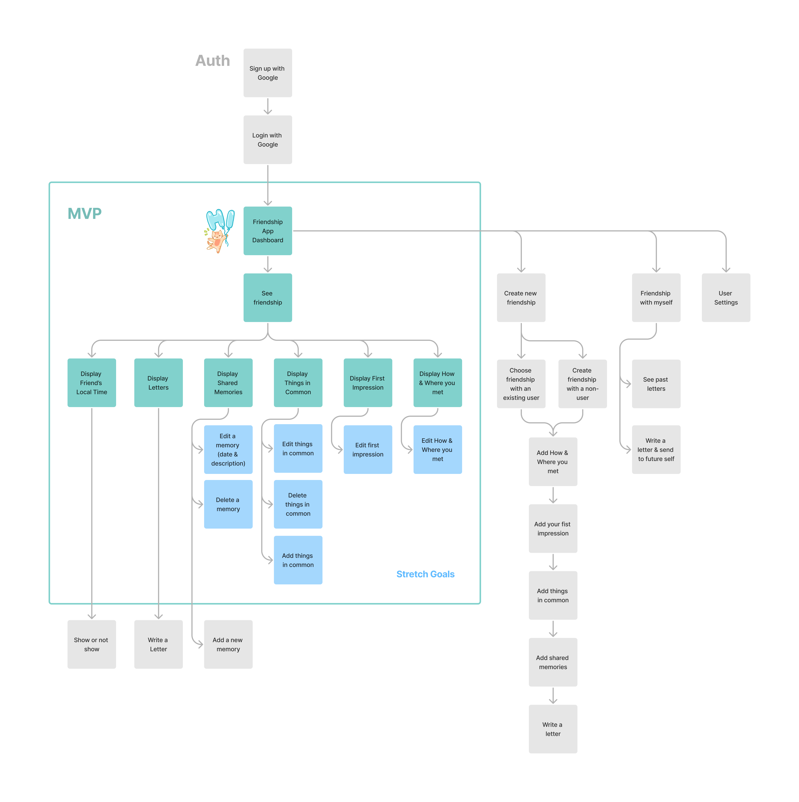
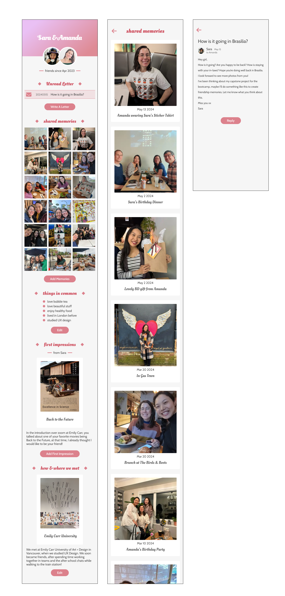
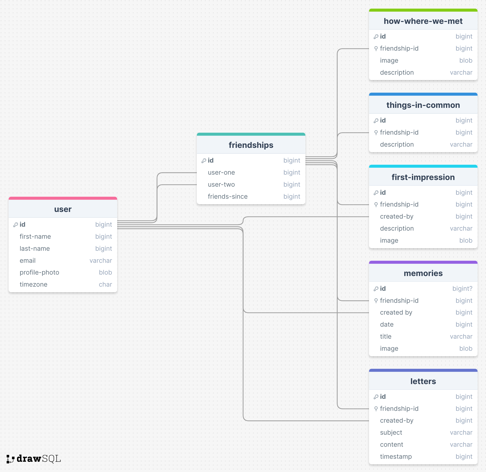

# Penguins - The Friendship App

## Overview

 **Penguins** is an app that enables users to store and share cherished memories with friends, including how they met, first impressions, and common interests. It also allows users to keep in touch by writing letters. This app is particularly useful for friends who no longer live in the same city.

### Problem

Current social media platforms are primarily focused on individual self-presentation, often portraying an idealized version of one's life rather than emphasizing the importance of relationships. **Penguins** addresses this gap by linking shared memories directly to friendships, making them visible only to the involved friend. The goal is to create a space where users can truly cherish and nurture their relationships with different friends.

### User Profile

- People who want to keep in contact with friends they don't see regularly, e.g., because they live in a different city or country.
- People who want to have a dedicated space for showing their cherished friendships.
- People who value privacy and prefer sharing personal memories in a more intimate setting.

### Features

#### MVP Features

- See friendship details
    - Display friend's current time
    - Display letters to each other
    - Display memories from when you spent time together
    - Display things in common with your friend
    - Display your first impression of the friend
    - Display how & where you and your friend met

#### Stretch Goals

- Edit friendship details
    - Edit how & where you and your friends met
    - Edit your first impression of the friend 
    - Edit things in common with your friend
    - Edit memory details
- Write a new letter
- Add photos when you spend time together


## Implementation

### Tech Stack

#### FrontEnd
- react
- react-router-dom
- axios
- sass

#### BackEnd
- express
- knex
- cors
- dotenv
- nodemon
- multer
- uuid
- mySQL

### APIs

No external APIs will be used for the first sprint

### Sitemap



### Mockups



### Data

#### First Stage

- Store everything in the JSON file in the backend.

#### Second Stage

- Implement database to connect to the backend.

    

### Endpoints

#### MVP
##### GET /friendships/:id
- get timezones
- get letters
- get memories
- get things in common
- get first impression details
- get how we met details

Example Response:
```
[
  {
    "friendship-id": 1,
    "user-1-first-name": "Sara",
    "user-1-profile": "user-1.png",
    "user-2-first-name": "Amanda",
    "user-2-profile": "user-2.png",
    "friends-since": "Apr 2024",
    "letters": [
      {
        "id": 1,
        "friendship-id": 1,
        "created-by": 1,
        "subject": "...",
        "emailContent": "...",
        "isRead": true
      }
    ],
    "memories": [
      {
        "id": 1,
        "friendship-id": 1,
        "created-by": 1,
        "date": "May 13 2024",
        "title": "Amanda wearing Sara’s Sticker Tshirt",
        "image": "memories-1.png"
      }, ...
    ],
    "things-in-common": [
      {
        "id": 1,
        "friendship-id": 1,
        "description": "love bubble tea"
      }, ...
    ],
    "first-impression": [
      {
        "id": 1,
        "friendship-id": 1,
        "created-by": 1,
        "description": "...",
        "image": "first-impressions-1.png"
      }, ...
    ],
    "how-where": {
      "id": 1,
      "friendship-id": 1,
      "image": "how-where-1.png",
      "description": "..."
    }
  }
]
```
#### Stretch Goals

##### PUT /how-where/:id

##### PUT /first-impression/:id

##### PUT /things-in-common/:id

##### PUT /memories/:id

##### POST /letters

##### POST /memories

### Auth

No Auth will be implemented for the MVP.

## Roadmap

1. Build the backend for the GET /friendships/:id request, which returns hardcoded data.
2. Build the frontend with the hardcoded data fetched from the backend.
3. Create database for the back end.
4. Linking the backend to database and request data.
5. Build backend for the GET /friendships/:id. 
6. Make any fixes to the frontend to properly show dynamic data coming from the backend.
7. Build backend PUT /how-where/:id and implement "edit how & where users met" functionality in the frontend.
8. Build backend PUT /first-impression/:id and implement "edit first impression" functionality in the frontend.
9. Build backend PUT /things-in-common/:id and implement "edit first impression" functionality in the frontend.
10. Build backend PUT /memories/:id and implement "update a memory" functionality in the frontend.
11. Build backend POST /letters and implement "write a letter" functionality in the frontend.
12. Build backend POST /memories and implement "add a memory" functionality in the frontend.

## Nice-to-haves

### Future Features
- Friendship with yourself - write a letter to future self
- Have multiple users so they can connect with each other
- Create multiple friendships with exisiting users
- Reminder to write a letter to a specific friend
- Invite the friend to join the app to interact
- Display random momeries of the friendships